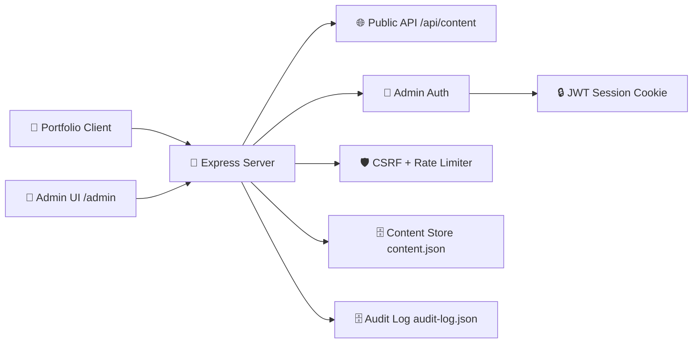

<div align="center">


</div>

<!-- readme-gen:start:badges -->
<p align="center">
	
	
	
	
	
</p>

<p align="center">
	
	
	
	
</p>
<!-- readme-gen:end:badges -->

<!-- readme-gen:start:tech-stack -->
<p align="center">
	
</p>
<!-- readme-gen:end:tech-stack -->

This project blends a cinematic front-end portfolio with a secure admin control plane, so content updates can happen live without touching frontend code. It is built for mixed audiences: recruiters get an immersive showcase, while developers get a production-minded backend with auth, CSRF protection, validation, and audit logs.


## Highlights

<table>
<tr>
<td width="50%" valign="top">

### Cinematic Experience
Scroll-driven scenes and polished visual storytelling make the portfolio memorable at first glance.

</td>
<td width="50%" valign="top">

### Secure Admin Plane
JWT session cookies, CSRF double-submit protection, and rate limiting guard admin operations.

</td>
</tr>
<tr>
<td width="50%" valign="top">

### Dynamic Content API
Public pages render from server content payloads, enabling live updates without redeploying frontend files.

</td>
<td width="50%" valign="top">

### Auditable Publishing
Every login and content mutation is tracked in an audit stream for operational transparency.

</td>
</tr>
</table>

## Quick Start

```bash
git clone https://github.com/bhavyup/My-Portfolio.git
cd My-Portfolio
npm install
```

Create a root `.env` file with required values:

```bash
ADMIN_USERNAME=admin
ADMIN_PASSWORD_HASH=<bcrypt-hash>
JWT_SECRET=<long-random-secret>
CSRF_SECRET=<long-random-secret>
PORT=3000
NODE_ENV=development
```

Generate a bcrypt hash for the admin password:

```bash
npm run admin:hash -- YourStrongPasswordHere
```

Run the app:

```bash
npm run dev
```

- Portfolio: http://localhost:3000
- Admin: http://localhost:3000/admin

## Screenshots

<table>
	<tr>
		<td width="50%" align="center">
			
			<p><strong>Portfolio Experience</strong></p>
		</td>
		<td width="50%" align="center">
			
			<p><strong>Project Showcase Card</strong></p>
		</td>
	</tr>
</table>


## Architecture

<!-- readme-gen:start:architecture -->

<!-- readme-gen:end:architecture -->

## Usage

### Public Mode
- Open `/` to view the portfolio.
- Frontend fetches `GET /api/content` for dynamic section rendering.

### Admin Mode
- Visit `/admin` and authenticate.
- Edit full content or section-level payloads.
- Publish updates and review audit history.

## API Reference

| Method | Route | Auth | Description |
|:--|:--|:--:|:--|
| GET | `/api/health` | No | Health check with environment and timestamp. |
| GET | `/api/content` | No | Public content payload for frontend rendering. |
| GET | `/admin/auth/csrf` | No | Issues CSRF token cookie and response token. |
| POST | `/admin/auth/login` | No | Admin login and session cookie issuance. |
| POST | `/admin/auth/logout` | Yes | Clears admin session and CSRF cookie. |
| GET | `/admin/auth/session` | Yes | Returns current authenticated session details. |
| GET | `/admin/api/content` | Yes | Reads full content snapshot. |
| PUT | `/admin/api/content` | Yes + CSRF | Replaces entire content payload. |
| PATCH | `/admin/api/content/:section` | Yes + CSRF | Updates one top-level section. |
| GET | `/admin/api/audit` | Yes | Returns audit events. |

## Configuration

| Variable | Required | Purpose |
|:--|:--:|:--|
| `ADMIN_USERNAME` | Yes | Admin login username. |
| `ADMIN_PASSWORD_HASH` | Yes | Bcrypt hash of admin password. |
| `JWT_SECRET` | Yes | Signing secret for admin session token. |
| `CSRF_SECRET` | Yes | HMAC secret for CSRF token signing. |
| `PORT` | No | HTTP port, defaults to 3000. |
| `NODE_ENV` | No | Runtime mode (`development` or `production`). |

## Project Structure

<!-- readme-gen:start:tree -->
```text
📦 single-page-portfolio
├── 📄 index.html               # Public portfolio shell
├── 📄 styles.css               # Portfolio styling
├── 📄 script.js                # Client rendering + interactions
├── 📂 assets/
│   ├── 📂 images/              # Portfolio and project visuals
│   └── 📂 resume/              # Resume assets
├── 📂 server/
│   ├── 📄 app.js               # Express app and route wiring
│   ├── 📄 auth.js              # Session + CSRF auth helpers
│   ├── 📄 config.js            # Environment config and validation
│   ├── 📄 contentStore.js      # Validated content reads/writes
│   ├── 📄 contentSchema.js     # Zod schema for content payload
│   ├── 📄 auditStore.js        # Audit event persistence
│   ├── 📂 data/
│   │   ├── 📄 content.json     # Dynamic portfolio content source
│   │   └── 📄 audit-log.json   # Append-only audit trail
│   └── 📂 public/admin/
│       ├── 📄 index.html       # Admin interface
│       ├── 📄 styles.css       # Admin styling
│       └── 📄 app.js           # Admin client behavior
└── 📄 package.json             # Scripts and dependencies
```
<!-- readme-gen:end:tree -->


## Project Health

<!-- readme-gen:start:health -->
| Category | Status | Score |
|:--|:--:|--:|
| Tests | ███████████████████░ | 95% |
| CI/CD | ██████████████████░░ | 90% |
| Type Safety | ███████████████████░ | 95% |
| Documentation | █████████████████░░░ | 85% |
| Coverage | ████████████████████ | 99% |

> Overall: 93% — Production checks are enforced in CI with green lint/typecheck/tests, high coverage, and zero high-severity vulnerabilities.
<!-- readme-gen:end:health -->

## Contributing

Contributions are welcome.

1. Fork the repository and create a feature branch from `main`.
2. Run the app locally and validate both portfolio and admin flows.
3. Open a pull request with a concise summary and testing notes.

## License

No license file is currently present in this repository.

<!-- readme-gen:start:footer -->
<div align="center">


Built with love by [Contributors](https://github.com/bhavyup/My-Portfolio/graphs/contributors)

</div>
<!-- readme-gen:end:footer -->
